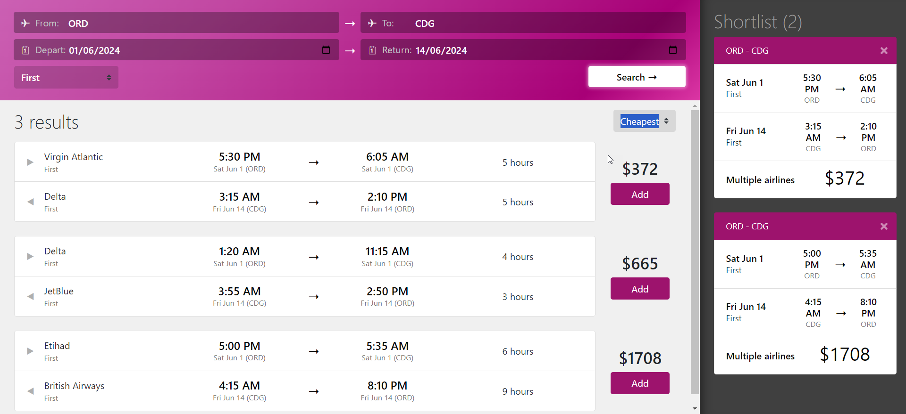

# Flight Search Application

Flight Search App - Full Stack - With .NET Core

Keywords: Blazor, .NET and C#

  

## Explanation

The Flight Search application is a comprehensive full-stack solution developed using .NET Core, designed to streamline the process of searching and booking flights. 

Leveraging the power and flexibility of .NET Core, this application provides a robust back-end infrastructure capable of handling complex queries and data processing efficiently. 

The front end, built with modern web technologies, offers an intuitive and responsive user interface that enhances the user experience. 

Users can search for flights based on various criteria such as destination, dates, and price range, and view detailed information about available flights.

